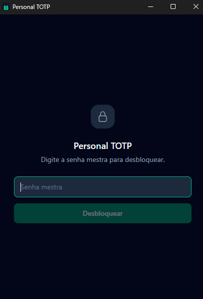
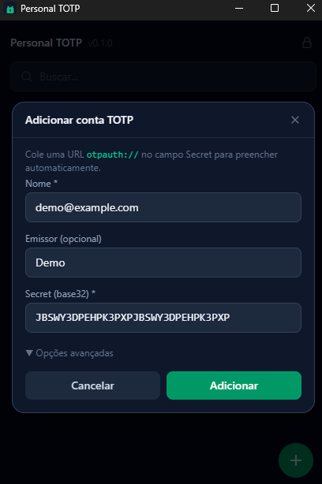
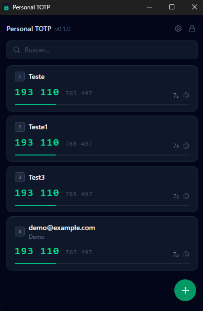

# Personal TOTP

A lightweight desktop TOTP authenticator for Windows, macOS, and Linux. Stores all secrets encrypted with a master password and generates codes in real time — no cloud, no sync, no telemetry.

## Features

- **Encrypted vault** — secrets stored with AES-256-GCM, master password never touches disk
- **Current + next code** — each entry shows the active code, the upcoming code, and a countdown bar
- **Search** — filter entries in real time; keyboard shortcuts respect the active filter
- **Full entry management** — add, edit, and delete accounts; edit leaves the secret unchanged if the field is left blank
- **Global shortcut** — opens the app from anywhere; configurable in Settings (default `Alt+Shift+A`)
- **Lives in the tray** — closing the window hides it; the process keeps running
- **Auto-lock** — vault locks after a configurable timeout (default 5 min) or can be disabled
- **Keyboard-first** — press `1`–`9` to copy a code and dismiss in one keystroke
- **Favorites + smart sort** — pin entries to the top; rest ordered by most recently used
- **`otpauth://` paste** — paste a QR URL into the Secret field to auto-fill all fields
- **Multi-language** — Portuguese (Brazil) and English (US); follows the system language by default, switchable in Settings
- **Import / Export** — back up all tokens to a JSON file and restore them on any installation

## Stack

| Layer    | Technology                                            |
|----------|-------------------------------------------------------|
| UI       | React 19 + TypeScript + Tailwind v4                   |
| Desktop  | Tauri v2                                              |
| Backend  | Rust                                                  |
| Database | SQLite (`rusqlite` bundled)                           |
| Crypto   | Argon2id (key derivation) + AES-256-GCM (encryption) |
| TOTP     | `totp-rs` v5                                          |

## Building from source

**Prerequisites:** [Rust](https://rustup.rs), [Node.js](https://nodejs.org), [pnpm](https://pnpm.io)

```bash
git clone https://github.com/your-username/personal-totp
cd personal-totp
pnpm install
pnpm tauri build
```

The installer is generated in `src-tauri/target/release/bundle/`.

For development with hot-reload:

```bash
pnpm tauri dev
```

---

## Usage

### 1. First run — set a master password

On first launch you'll be prompted to create a master password. This password derives the encryption key for all your secrets. **There is no recovery — if you forget it, the vault cannot be opened.**

### 2. Unlock



Enter your master password to unlock the vault. The key lives in memory only — it is wiped when you lock or quit.

### 3. Add an account



Click **+** to open the add dialog. You can either:

- **Paste an `otpauth://` URL** in the Secret field — all fields fill in automatically
- **Fill manually** — Name, Issuer (optional), and the base32 secret from your service

> Most services provide a "Can't scan QR code?" link that reveals the `otpauth://` URL or the raw secret.

### 4. Generate and copy codes



The current and next codes are shown for each entry along with a countdown bar. Click any entry to copy the current code to the clipboard.

Use the **search bar** to filter by name or issuer — keyboard shortcuts `1`–`9` operate on the filtered list.  
Hover an entry to reveal the **edit** (pencil) and **delete** (trash) buttons.

### 5. Settings

Click the gear icon (top-right) to open Settings:

| Setting | Options |
|---------|---------|
| Language | Português (Brasil) · English (US) |
| Global shortcut | Click the key display and press any modifier + key combination |
| Auto-lock | Never · 5 · 10 · 15 · 30 · 60 minutes |
| Import / Export | Import or export tokens as JSON; download a template to see the expected format |
| Diagnostics | Opens the log folder for troubleshooting |

---

## Keyboard shortcuts

| Key                          | Action                                                    |
|------------------------------|-----------------------------------------------------------|
| Global shortcut (default `Alt+Shift+A`) | Toggle the window from anywhere — configurable in **Settings → Global shortcut** |
| `S`                          | Focus the search bar (when no modal is open)              |
| `1` – `9`                    | Copy the nth visible code and hide the window to the tray |
| `Esc` (search focused)       | Unfocus the search bar                                    |
| `Esc`                        | Hide the window to the tray                               |

The global shortcut works system-wide; all other shortcuts work only while the app window is focused.

Shortcuts `1`–`9` respect the current search filter and the favorites/recency sort order. Typical flow: open app → `S` → type to filter → `Esc` → `1` to copy and dismiss.

---

## Import / Export

Access via **Settings → Import / Export**.

### Export

Saves all tokens to a JSON file with their decrypted secrets. Use this to back up your vault or migrate to another device.

> **Keep the exported file secure** — it contains plaintext secrets that can be used to generate your 2FA codes.

### Import

Imports tokens from a JSON file in the format below. Entries with an invalid secret are skipped; the result shows how many were imported and how many failed.

### JSON format

```json
{
  "app": "Personal TOTP",
  "version": 1,
  "entries": [
    {
      "name": "GitHub",
      "issuer": "github.com",
      "secret": "JBSWY3DPEHPK3PXP",
      "algorithm": "SHA1",
      "digits": 6,
      "period": 30
    }
  ]
}
```

| Field | Required | Default | Description |
|-------|----------|---------|-------------|
| `name` | ✓ | — | Display name for the account |
| `secret` | ✓ | — | Base32-encoded TOTP secret |
| `issuer` | | `""` | Service domain or provider name |
| `algorithm` | | `SHA1` | Hash algorithm: `SHA1`, `SHA256`, or `SHA512` |
| `digits` | | `6` | Code length: `6` or `8` |
| `period` | | `30` | Rotation interval in seconds: `30` or `60` |

The `app` and `version` fields are ignored on import — only `entries` is read. Click **Download JSON template** in Settings to get a pre-filled example file.

---

## Forgot your password?

There is no password recovery — the encryption key is derived from the master password and never stored. If you forget it, the vault cannot be opened.

To start fresh, click **"Forgot your password?"** on the unlock screen. You will be asked to type `DELETE` to confirm. This permanently deletes all saved tokens and lets you create a new vault with a new master password.

---

## Security

- The master password is **never stored** — only its Argon2id-derived key is kept in memory
- Each TOTP secret is encrypted individually with a unique random nonce (AES-256-GCM)
- The vault auto-locks after a **configurable timeout** (default 5 min; Never/5/10/15/30/60 min via Settings)
- The database file contains no plaintext secrets or passwords

See [`docs/crypto.md`](docs/crypto.md) for the full cryptographic scheme.
